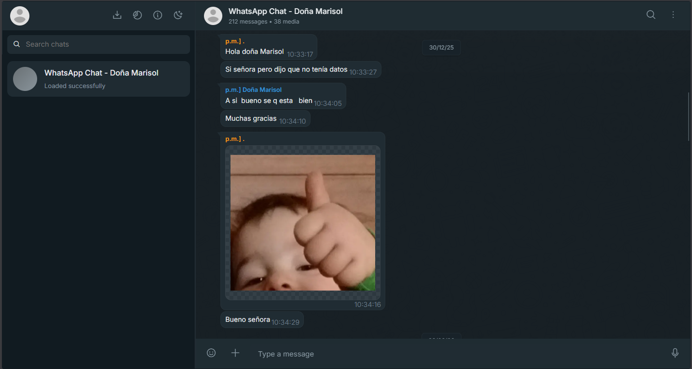
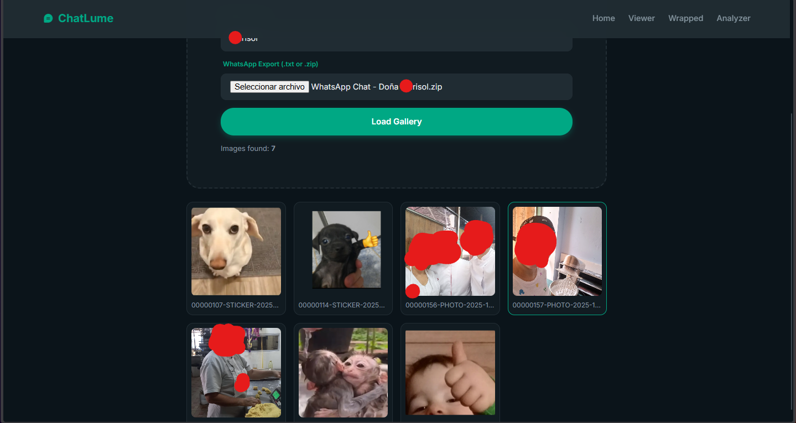

# ChatLume (Formerly Obsidian) - WhatsApp Chat Viewer


## Mi contribución  

Este repositorio es una bifurcación personal de ChatLume donde me centré en mejorar la experiencia multimedia dentro del visor de chats de WhatsApp.

Mi principal contribución fue implementar y mejorar la compatibilidad para ver imágenes directamente en el chat, abriéndolas en una vista tipo galería, y añadir la opción de reproducir archivos de audio desde la misma interfaz de conversación. El objetivo era que los chats de WhatsApp exportados se sintieran más completos, interactivos y cercanos a la experiencia original de WhatsApp, en lugar de mostrar solo mensajes de texto o archivos adjuntos descargables.

A continuación se muestran capturas de pantalla de las mejoras añadidas en esta versión:

### Chat media preview



### Gallery-style image viewer



ChatLume (Formerly Obsidian) is a privacy-first WhatsApp export viewer.
It parses exported `.txt` files (or `.zip` files that contain a `.txt`) directly in your browser and renders a WhatsApp-like chat UI with search, analytics, and inline media support.

## Attribution

This repository is a derivative work of [ChatLume](https://github.com/ParasSharma2306/ChatLume), originally created by Paras Sharma.

This fork includes custom improvements focused on media visualization, including inline image preview, gallery-style image viewing, and audio playback inside the chat interface.

## Privacy

- All parsing is local in the browser.
- No server upload is required.
- Your chat file never leaves your machine unless you choose to host/modify the app yourself.
- **PWA Enabled**: Install ChatLume to your device and use it fully offline with no internet connection required.

## Current Features

- Import WhatsApp exports from `.txt` and `.zip`.
- Robust line parser with multiline message continuation support, including date separators like `/`, `-`, and `.`.
- Message list rendering with grouped bubbles and date separators.
- Inline rendering for images, stickers, videos, audio, and downloadable documents from ZIP exports.
- Gallery-style image viewer for browsing chat images more comfortably.
- Audio playback directly inside the chat interface.
- Lazy loading for inline images and video so large chats stay smoother.
- Real-time message search with highlight and up/down navigation.
- Jump-to-date action from the header menu.
- Analytics drawer for total message count, media count, and sender distribution.
- Dark/light theme toggle.
- Loading overlay and disabled actions while parsing to prevent accidental double loads.
- Responsive desktop/mobile layout.

## Limitations

- Missing attachments are shown clearly when the export references a file that is not present in the ZIP.
- Date-jump accuracy depends on date markers and locale format in the export.
- Very uncommon localized export phrases may still need additional parser rules.
- Extremely large exports can still take time to parse because everything is processed locally in-browser.

## Quick Start

1. Export a chat from WhatsApp.
2. Choose `Without Media` for faster parsing, or `Include Media` if you want to view images, audio, videos, and documents.
3. Open this project and load `index.html` in a browser.
4. Enter your display name exactly as it appears in the chat export.
5. Upload the `.txt` or `.zip` and click `Load Chat`.

## Local Development

This project has no build step.

Option A: open `index.html` directly.

Option B: serve statically (recommended for consistent browser behavior):

```bash
# Python 3
python -m http.server 8080
```

Then open http://localhost:8080.

Tech Stack
Vanilla JavaScript (ES6)
CSS3
JSZip
 for .zip parsing
Phosphor Icons
Notes
User-generated message content is HTML-escaped before rendering.
External links are opened with rel="noopener noreferrer".
Search query regex is escaped to prevent invalid regex crashes.
Menu interactions and date-jump fallbacks handle older browser behavior.
German exports using dates like 01.04.26 and attachment labels like Datei angehängt are supported.
Community Credit
German export parsing and attachment-label feedback came from Reddit user u/jacckyryan.
Contributing
Fork the repository.
Create a branch: git checkout -b feature/your-feature.
Commit changes: git commit -m "feat: add your feature".
Push branch and open a Pull Request.
License

Distributed under the MIT License. See LICENSE
 for more information.

Original Author

Paras Sharma

Website: parassharma.in
GitHub: @parassharma2306
Fork Maintainer / Contributions

This fork is maintained by Santiago Córdoba and includes improvements focused on media handling, image visualization, gallery-style previews, and audio playback inside exported WhatsApp chats.

Live Demo

chatlume.parassharma.in

Note: This project is not affiliated with or endorsed by WhatsApp Inc.
